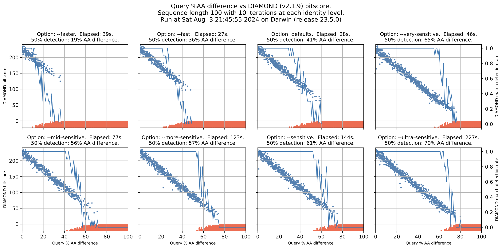

# DIAMOND sensitivity and bitscore analysis

Here is a simple analysis of how
[DIAMOND](https://github.com/bbuchfink/diamond) bitscore changes according to
its sensitivity setting and the match (if any) between a subject sequence and
query sequences with varying amino acid identity.

## Results

The plot of all sensitivity options looks like this:



### What do we learn from all this?

* The names DIAMOND uses to indicate speed or sensitivity don't mean much.
* The `--fast` and `--faster` options are no faster (in fact sometimes both are
  slower) than DIAMOND's default (when no speed/sensitivity
  option is specified).
* The `--faster` option fails to match much sooner (in terms of
  decreasing AA identity) than all other options.
* The default setting has a good tradeoff between speed and detection.
* If you want to do better, the best next step is `--very-sensitive` (which
  does better detection and is much better than `--sensitive`,
  `--mid-sensitive`, and `--more-sensitive`).
* `--ultra-sensitive` has the best detection, but getting to detection at the
  70% AA difference level takes about 5x as long as the 65% AA difference
  detection achieved by `--very-sensitive`.

Overall, I would use the defaults if you want things to be fast and don't
care about being able to reliably detect matches with more than 40% AA
difference. Use `--very-sensitve` if you want much better detection (50%
better) for which you'll pay less than a 2x time penalty.

### Future?

I didn't try combining any options, like `--faster --very-sensitive`. I'm not
sure that's worth trying (or even allowed) since it's obvious from the plots
that the `--fast` and `--faster` options both reduce sensitivity. So a
combination like the above is asking to both reduce and increase sensitivity,
which doesn't sound very useful.

## Requirements

You'll need Python and

* [DIAMOND](https://github.com/bbuchfink/diamond) (documentation [here](https://github.com/bbuchfink/diamond/wiki)), and
* [dark-matter](https://github.com/acorg/dark-matter) (try `pip install dark-matter`)

## Execution

The default is to try to match a 100 amino acid string with queries that vary
from fully identical to fully mismatched, with each level of mismatch done 10
times. To run with these defaults, use `./bitscore-vs-identity.py`. This will
write `plot.pdf` by default, which you can change via `--output`.

The output from such a run is in this repo as `plot.pdf` and (as a screenshot
of the PDF) `plot.png`.

The subplot titles indicate the sensitivity setting argument passed to
`diamond blastx` (with the leading `--` removed) or "default" if no argument
was passed, plus the elapsed time in seconds (in parens).  The elapsed time is
for the whole plot - i.e., all identity levels times the number of iterations
at each level. The sensitivity names DIAMOND uses imply (to me) run times
that don't match very well with the reality.

The reddish (actually "tomato") dots at the bottom of the subplots (with
negative bitscores) indicate calls when DIAMOND failed to match at that
identity level (i.e., at that amino acid mismatch count).

Note that on OS X 14.5 the Python `subprocess` call to `diamond blastx`
occasionally does not return. I don't know why. When making the identical
call on the command line, `diamond` (v2.1.9) exits immediately with status
zero and no output (instead of writing a bitscore). When this happens, the
failing call is just repeated (with a different random subject and query).

### Variations

If you want to vary things, you can see available options via `--help`:

```
$ ./bitscore-vs-identity.py --help
usage: bitscore-vs-identity.py [-h] [--length N] [--blastxArgs ARGS] [--iterations N]
                               [--dotsize N] [--verbose] [--output FILENAME]
                               [--errorIncrement N]

Compute typical DIAMOND bitscores for a range of identities.

options:
  -h, --help          show this help message and exit
  --length N          The number of AAs in the test sequences.
  --blastxArgs ARGS   Additional (non-sensitivity) arguments to pass to 'diamond blastx'.
  --iterations N      The number of random sequences to test for each AA identity count.
  --dotsize N         The size of the dots for the scatter plots
  --verbose           Write intermediate processing output to standard error.
  --output FILENAME   The file to write a plot image to. File format is determined by suffix.
  --errorIncrement N  The number of additional errors (non-identical AAs) to add at each step.
```
